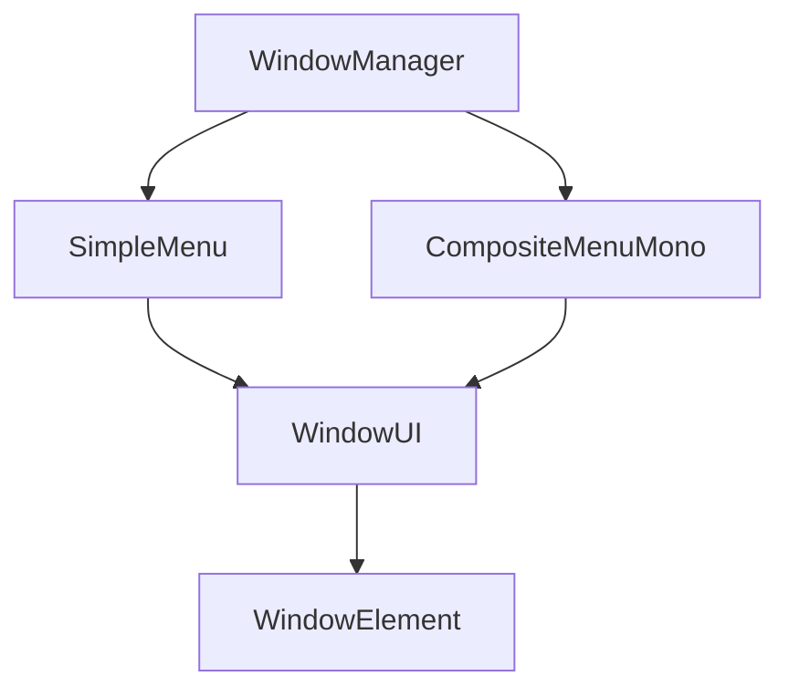

# APFramework UI System Document

After the initial alpha release of APFramework UI System, I reworked it to be more generally applicable, especially tailored more towards a robust out of box experience. However this framework is still more tailors towards people who are familiar with codes and would want to override the behavior here and there.

This document serves as a guide to help you modify the system to suite your need better.

Also APFramework UI System is kind of mouthful, so I'll be refering it as just the Framework.

## Overview



A quick overview of how the Framework is structured.

## WindowManager

`WindowManager` serves a the central hub of everything, it is mostly responsible to creating and updating all the resources. It also relays inputs to the menu currently in focus. Out of box `WindowManager` uses singleton pattern, to make it easier to access from anywhere. But in my personal project, I also initialize and update it with the overarching framework for granualar control.

The `WindowManager` needs to be initialized first before any subsequent call can be made, which is done using the `Awake` event function at the moment.

## Premade Menuing Systems

There are two premade menuing system for the Framework. Each of them serves as a self-constained environment to handle how navigation works within. But you can bypass them entiring and manage the underlying `WindowUI` directly if you want to.

Both menuing system share the `MenuSetup` struct to define their behavior. Additionally, default styling and layout of Windows can also be made by providing `MenuStyling` struct.

Currently the need for aligment is done through additional `LayoutAlignment` component which can be customized with `LayoutSetup` for the positioning of windows.

### CompositeMenuMono

`CompositeMenuMono` utilizes Unity's `MonoBehaviour` to allow setting up the styling and behavior of the menu easier with the serialized inspector. When working with `CompositeMenuMono`, you should start with inheriting the class, then override the `InitializeMenu` function and setup the menu initialization there.

With `CompositeMenuMono`, the menu will be initialized automatically during `Start` event function, but it might sometimes be better to get rid of that and initialize them by yourself.

### SimpleMenu

`SimpleMenu` is a cut down version of the `CompositeMenuMono` logic, with each instance only managing a single window and the navigation within. The cross menu navigation will be handled by `WindowManager` directly. Due to this characteristic, it is generally not idea to mix and match both menu at the same time which will definitely have some problems, but it is okay if one of them is not navigatable.

When using `SingleMenu`, it's best for on the fly instantiating of panels and stuffs.

## WindowUI

`WindowUI` is both the window logic handler and the presenter of the content. If you'd like to, you can just use the logic itself but setup your own presenter for the window. The visual stlying is defined through `WindowSetup`

`WindowUI`'s presenter is a convoluted function that loops through every single Window Element to build a long string that represents the window. Without Cysharp's ZString this will lead to multitude of allocations which is not idea at all. By default, `WindowUI` will queue the need to update it's content and only perform once during `LateUpdate` event function.

`WindowUI` is also responsible to check the change in value of `WindowElement`'s label and content when a `FunctionStringLabel` is used. This is useful for something that is constantly updating.

`WindowUI` also uses `WindowOutline` for stlying of its outline, and `WindowMask` for some transition animations.

## Window Element

`WindowElement` is the basic element within a window, it is structured to allow a builder style of settting up it's content. For example:

```C#
window.AddSlider<Quality>("This is a Slider that takes a Enum as value")
    .SetChoiceByValue(Enum.GetValues(typeof(Quality)).Cast<Quality>())
    .SetActiveValue(Quality.High);
    .SetAction(SetQuality)
```

The color choice of `WindowElement` is defined in `StyleUtility`, while currently the default text color has to be changed in the window template asset within `WindowManager` prefab.

## Performance

Even though the idea of the Framework is to be a lightweight UI system that can be accessed easily, there are some quirks to be noted. Namely how the text-based presentation can work against it somewhat.

Due to how a single window is a full piece of TextMeshPro, updating just a single element within the window will cause the window to rebuild. This is generally fine for a static menu, however when constant update occurs for a large menu that hosts tons of elements, kilobytes of GC per frame will happen, which is potentially tolerable depending on situation, but still less than ideal.

The solution: split them out into multiple windows. As long as the constantly updating element has its own window, the impact of rebuilding will be minimal. A 0.7 kilobyte of allocation per frame is observed when updating a window with a single constantly updating element.

Additionally, by default the framework will perform auto resizing whenever content update happens. You can call the `AutoResize`, `Resize` function yourself and designate the size to be fixed, this will prevent further auto resizing from happening.